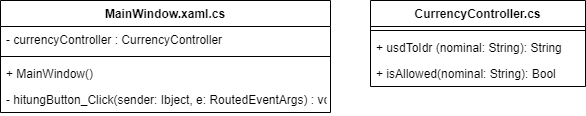

# Kalkulator uang
Untuk mengkonversi mata uang

Nama : Nur Fikri
Kelas : IF 03
NIM : 19.11.2790

## Latihan
##### 1. Mengapa perlu membuat class `CurrencyController.cs` pada percobaan 4?  
   Untuk memisahkan logic aplikasi dari main code, sehingga source code menjadi lebih bersih dan readable serta mudah dalam maintenance jika ingin dikembangkan lagi
##### 2. Jelaskan kegunaan method `isAllowed()` pada percobaan 4!  
   Digunakaan untuk memvalidasi dari inputan user, apakah valid atau tidak. Jika invalid, maka aplikasi memberikan feedback kalau inputan yang dimasukkan tidak valid
##### 3. Jelaskan secara singkat mengenai Regex pada percobaan 4!  
   Regex pada percobaan 4 digunakan untuk mengevaluasi nilai dari paramater dengan pola tertentu. Pola `[^0-9.0-]+` mengevaluasi apakah nilai 0-9, titik (.), dan minus (-)
   ada pada parameter atau tidak
##### 4. Buatlah class diagramnya pada percobaan 4!  
   